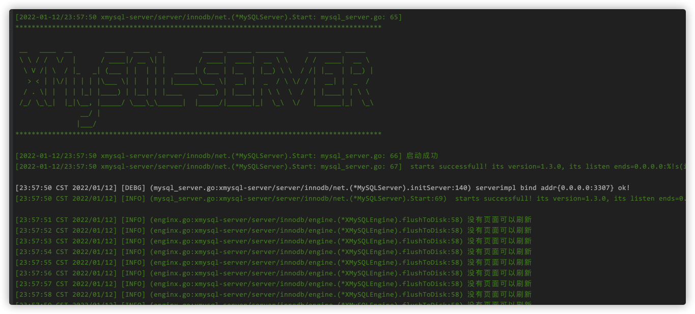

# XMysql-Server

#### 介绍

xmysql-server
本项目是本人基于现有文档的一个练手项目，加以学习golang,对mysql innodb做一次深入的理解而写的准备。本项目大致分为两个分之
默认分支是参考了tidb的代码，省去了写优化器的麻烦，优化器涉及到了相关论文。
#### 特性
1，存储方式参考innodb。与innodb有所不同，page页面虽然大小16KB，但是有所区别，在后面文档给出。</br>
2, SQL 执行基于火山模型，为什么不是其他？是因为学习的需要。</br>
3, 尽量还原innodb的特性</br>

### 参考开源项目
1，项目参考了tidb，鉴于优化器的涉及繁琐，本人就不写了，非常复杂。另外tidb的早期版本优化器，去掉了分布式数据库计算节点鲜明的代码，做了些变更。</br>
2，项目参考了<https://github.com/AlexStocks/getty>，做了一些变更</br>
3，项目参考更改了<https://github.com/timtadh/fs2>,原版的fs2只是利用了varchar作为btree disk存储，对于mysql page16KB显然是不合适的</br>
4，项目有选择<http://github.com/goioc/di> 作为IOC的框架，减少样板代码的编写</br>
5，项目涉及etcd,就不手写raft算法了。</br>

#### Roadmap

- [x]  innodb page 页面的设计实现 index fsp dict xdes </br>
- [x]  innodb row的设计实现</br>
- [x]  innodb btree的设计实现 （未测试）</br>
- [x]  innodb 段的设计实现 (未测试) </br>
- [x]  innodb 区的设计实现 (未测试)</br>
- [x] mysql的服务器端基于getty改造</br>
- [ ] SQL compiler
- [ ] 基于成本的查询优化器 (基于tidb早期火山模型更改，未完工)</br>
- [ ] 基于成本优化器的执行器
- [ ] mtr的设计实现
- [ ] 事物管理器的设计实现
- [ ] undo 和redo 的设计实现，目前已经实现一部分 </br>
- [ ] binlog的设计实现</br>
- [x] BufferPool的设计实现</br>
- [x] mysql的tcp协议部分 (未测试)</br>
- [ ] 子查询，join查询，函数等待完成</br>
- [ ] 基于CP的高可用</br>
- [ ] 客户端的设计实现</br>
- [ ] 设计文档说明</br>


#### 安装教程
```
git clone -b xxx https://github.com/zhukovaskychina/xmysql-server.git

cd xmysql-server&& sh ./build.sh
```
#### 启动效果




#### 软件架构（待补充）

1,网络层负责解析tcp协议，默认采用大端处理方式。</br>
2,SQL Compiler 负责编译SQL，校验SQL正确性。</br>
3,基于成本的优化器，获取最优路径。</br>
4,基于火山模型负责执行任务并返回结果。</br>

#### 文档(待补充)